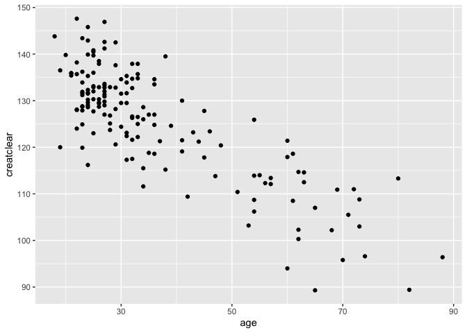

Exercise 1
==========

``` r
library(readr)
library(tidyverse)
library(mosaic)
urlfile = "https://raw.githubusercontent.com/jgscott/SDS323/master/data/ABIA.csv"
mydata <- read_csv(url(urlfile))
```

Data visualization: flights at ABIA
-----------------------------------

``` r
# Group data by airline and calculate mean arrival/departure delay
grouped_Data <- mydata %>% group_by(UniqueCarrier) %>% summarise(mean_DepDelay=mean(DepDelay,na.rm=TRUE),mean_ArrDelay=mean(ArrDelay,na.rm=TRUE), count=n())

#Get subset of top 5 airlines in terms of number of flights.
grouped_Data <- grouped_Data %>% arrange(desc(count))
grouped_Data <- grouped_Data %>% slice(1:5)

# Flatten data to seperate arrival and departure delay
grouped_Data <- grouped_Data %>% gather("Direction","Delay",-count,-UniqueCarrier)

grouped_Data$UniqueCarrier <- recode(grouped_Data$UniqueCarrier, AA="American", WN="Southwest",B6="JetBlue", YV="Mesa", CO="Continental")
ggplot(grouped_Data,aes(x=UniqueCarrier,y=Delay,fill=Direction)) +
  geom_col(position = "dodge") +
  ggtitle("Austin Flight Arrival/Departure Delay by Airline")+
  labs(x="Airline",y="Mean Delay")
```


<ins>
Conclusion
</ins>
<br> From the graph, it is reasonable to conclude that their is not any
significant difference in flight delays among the top 5 major airlines
flying out of Austin. The exception is Southwest Airlines which has the
lowest arrival delay. The reason for this could be that many of
Southwest flight into Austin are in-state flights and thus have less
time for delays to occur.

Regression Practice
-------------------

``` r
creatinine = read.csv("creatinine.csv",header=TRUE)
lm1 = lm(creatclear~age,data = creatinine)

#plug in age 55 to linear model to get expected creatine clearance rate
 
coef(lm1)
```

    ## (Intercept)         age 
    ## 147.8129158  -0.6198159

``` r
cleareance_rate55 = as.numeric(coef(lm1)[1]) + (55 * as.numeric(coef(lm1)[2]))
ggplot(creatinine) +
  geom_point(mapping=aes(x=age,y=creatclear))
```



1.  Based on the linear model we can expect a creatine clearance rate
    of  
    147.813 + (55\*-0.6198) = **113.723 ml/minute**.

2.  As age increases creatinine clearance rate decreases by **0.6198
    ml/minute per year**

3.  

E(Creatinine clearance rate \| Age = 40) = 147.813 + (40\*-0.6198) =
123.02

E(Creatinine clearance rate \| Age = 60) = 147.813 + (60\*-0.6198) =
110.624

135 - 123.0203 = 11.98

112 - 110.624 = 1.376

Because the residual is higher, the 40-year-old is healthier for his age
than the 60-year-old.

Green Buildings
---------------

I agree with the conclusions of her on-staff “data guru”. As you can see
from the following two graphs, Green Buildings (Buildings which are
LEED- or EnergyStar-certified) are more likely to be “Class A” buildings
whereas Non-Green buildings often are “Class B” or Class C" buildings.
Class A buildings are the highest quality of buildings on the market and
thus make for good investments.

``` r
building_data = read.csv("greenbuildings.csv",header=TRUE)
building_data = building_data[building_data$leasing_rate > 10.00,]
building_data = mutate(building_data,rent_diff = (Rent-cluster_rent))
building_data$class =ifelse(building_data$class_a == 1,"a",ifelse(building_data$class_b == 1,"b","c"))
building_data$green_rating = recode(building_data$green_rating,`1`="Green Building", `0`="Non-Green Building")

ggplot(building_data[building_data$green_rating=="Green Building",],aes(x=class))+
  geom_bar()+
  ggtitle("Green Building Class Distributuion")
```


``` r
ggplot(building_data[building_data$green_rating!="Green Building",],aes(x=class))+
  geom_bar()+
  ggtitle("Non-Green Building Class Distributuion")
```


Instead of just comparing the difference in median rent/sq. ft charged
to tenants like the “data guru”. I decided to compare the difference
between the rent/sq ft. of each building with the corresponding cluster
rent (Labled in the below graph as “rent\_diff”). This way, we can
calculate how high the rent is relative to other buildings in its
cluster.

``` r
building_data = mutate(building_data,total_cost = Gas_Costs + Electricity_Costs)
ggplot(building_data, aes(x=rent_diff, color=green_rating))+
  geom_density()+
  scale_x_continuous(limits = c(-25, 50))
```


From the density plot, we can conclude that density of Green Buildings
who charge higher rent to their tenants (relative to other buildings in
their cluster) is higher than the density of Non-Green Buildings. As a
result, Green Buildings can generate more revenue than Non-Green
Buildings.

Milk Prices
-----------

P = Price Charged Q = Quantity Sold N = Profit C = Cost

(Equation 1) N = Q \* (P - C)

= (P-c) \* f(P) because Q is a function P

To find f(p) we run a regression on the equation Q = KP^E where E is
elasticity and K is a constant:

``` r
milk_data = read.csv("milk.csv")

lm(log(sales) ~ log(price),data=milk_data)
```

    ## 
    ## Call:
    ## lm(formula = log(sales) ~ log(price), data = milk_data)
    ## 
    ## Coefficients:
    ## (Intercept)   log(price)  
    ##       4.721       -1.619

Following the regression we have the equation:

log(Q) = 4.7 - 1.62 \* log(P) =&gt;

(Equation 2) Q = e^4.7 \* P^-1.62

Plugging in Equation 2 into Equation 1 we get

(Equation 3) N = (P-C) \* (110 \* P^-1.62)

Now to find the max of the equation it easier to take the log

n(P) = log(P-C) + log(110) - 1.62 \* log(P)

Take the first derivative.

n’(P) = 1/(P-C) - 1.62/P

Set the equation equal to 0 to find the critical point

0 = 1/(P-C) - 1.62/P

Solve for P to get the max price in terms of the wholesale cost

**P = 81C / 31 **

Example:

If we let the wholesale cost C = 1 then the price we would charge for a
gallon of milk would be

P = 81/31 = **$2.61**

To calculate the net profit we plug P into Equation 3 to get

N = (2.61 - 1) \* 110 \* 2.61^-1.62

Net Profit = **$37.43**
