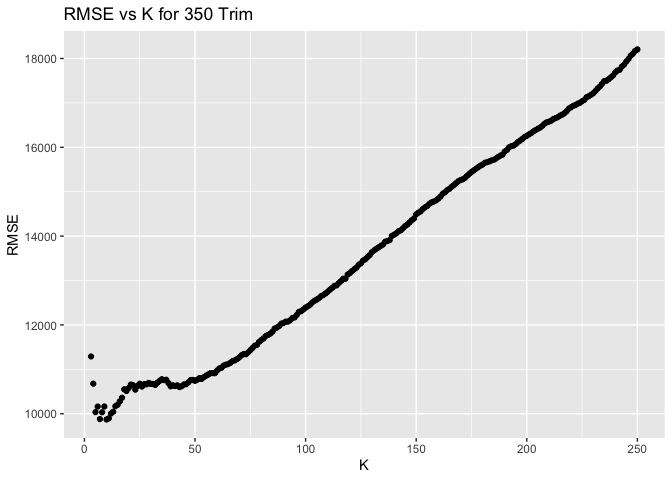
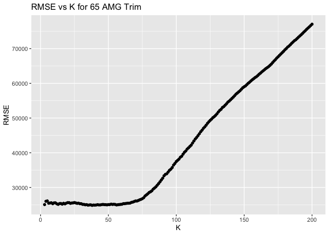

# Exercise 2

``` r
library(tidyverse)
library(mosaic)
library(FNN)
library(foreach)
library(scales)
```

## KNN Practice

``` r
sclass = read.csv("sclass.csv")

# Split data based on trim
trim_350 = sclass[sclass$trim == "350",]
trim_65 = sclass[sclass$trim == "65 AMG",]
```

First split the data into training and test sets for both trim data

``` r
# Define the training and testing set for 350 trim
N_350 = nrow(trim_350)
N_train_350 = floor(0.8*N_350)
N_test_350 = N_350 - N_train_350
train_ind_350 = sample.int(N_350, N_train_350, replace=FALSE)
D_train_350 = trim_350[train_ind_350,]
D_test_350 = trim_350[-train_ind_350,]
x_train_350 = select(D_train_350,mileage)
y_train_350 = select(D_train_350,price)
x_test_350 = select(D_test_350, mileage)
y_test_350 = select(D_test_350, price)

# Define the training and testing set for 65 AMG trim
N_65 = nrow(trim_65)
N_train_65= floor(0.8*N_65)
N_test_65 = N_65 - N_train_65
train_ind_65 = sample.int(N_65, N_train_65, replace=FALSE)
D_train_65 = trim_65[train_ind_65,]
D_test_65 = trim_65[-train_ind_65,]
x_train_65 = select(D_train_65,mileage)
y_train_65 = select(D_train_65,price)
x_test_65 = select(D_test_65, mileage)
y_test_65 = select(D_test_65, price)
```

Then Plot RMSE vs K graphs to find the K which gives the minimum RMSE
for both models

``` r
rmse = function(y, ypred) {
  sqrt(mean(data.matrix((y-ypred)^2)))
}
fit_KNN_model <- function(k, x_train, x_test, y_train, y_test){
  knnModel = knn.reg(train=x_train, test=x_test, y = y_train, k=k)
  rmse(y_test, knnModel$pred)
}

k_grid_350 = 3:250
rmse_grid_350 = foreach(K=k_grid_350, .combine='c') %do% {
  fit_KNN_model(K,x_train_350, x_test_350, y_train_350, y_test_350)
}

k_grid65 = 3:200
rmse_grid_65 = foreach(K=k_grid65, .combine='c') %do% {
  
  fit_KNN_model(K,x_train_65, x_test_65, y_train_65,y_test_65)
}
ggplot()+
  geom_point(data.frame(K=k_grid_350,RMSE=rmse_grid_350),mapping=aes(K,RMSE)) +
  ggtitle(("RMSE vs K for 350 Trim"))
```

<!-- -->

``` r
minK_350 = data.frame(x=k_grid_350,y=rmse_grid_350) %>% subset(y == min(rmse_grid_350))
cat("The KNN model with the minimum RMSE is fitted with K =",minK_350[1,1], "for a trim level of 350." )
```

    ## The KNN model with the minimum RMSE is fitted with K = 76 for a trim level of 350.

``` r
ggplot()+
  geom_point(data.frame(K=k_grid65,RMSE=rmse_grid_65),mapping=aes(K,RMSE)) +
  ggtitle(("RMSE vs K for 65 AMG Trim"))
```

<!-- -->

``` r
minK_65 = data.frame(x=k_grid65,y=rmse_grid_65) %>% subset(y == min(rmse_grid_65))
print(cat("The KNN model with the minimum RMSE is fitted with K =",minK_65[1,1], "for a trim level of 65 AMG."))
```

    ## The KNN model with the minimum RMSE is fitted with K = 38 for a trim level of 65 AMG.NULL

From the graphs the optimal K value is 13 for 350 trim and 7 for 65 AMG
trim.

Lastly, plot both models over the test data.

``` r
# fit knn models for optimal k
knnModel350 = knn.reg(train=x_train_350, test=x_test_350, y = y_train_350, k=13)
knnModel65 = knn.reg(train=x_train_65, test=x_test_65, y = y_train_65, k=7)

# attach the predictions to the test data frame
D_test_350$ypred_knn = knnModel350$pred
D_test_65$ypred_knn = knnModel65$pred

ggplot(data=D_test_350) + 
  geom_point(mapping = aes(x=mileage, price, color = "lightgrey")) +
  geom_point(mapping = aes(x=mileage, y= ypred_knn, color="red") ) +
  theme_bw()+
  ggtitle("KNN Model (k=13) for Price vs Mileage for 350M Trim")+
  scale_color_manual(values=c("lightgrey","red"), labels=c("Data", "Predictions"))+ 
  scale_x_continuous(labels = scales::comma)
```

<!-- -->

``` r
ggplot(data=D_test_65) + 
  geom_point(mapping = aes(x=mileage, price, color = "lightgrey")) +
  geom_point(mapping = aes(x=mileage, y= ypred_knn, color="red") ) +
  theme_bw()+
  ggtitle("KNN Model (k=7) for Price vs Mileage for 65 AMG Trim")+
  scale_color_manual(values=c("lightgrey","red"), labels=c("Data", "Predictions"))+ 
  scale_x_continuous(labels = scales::comma)
```

<!-- --> Q2 advice:
combine values from land model and house improvement
