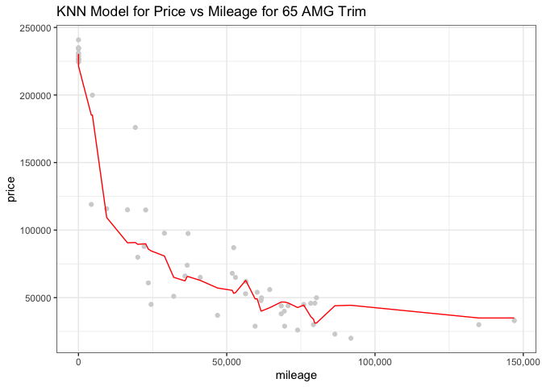

# Exercise 2

## KNN Practice

**Goal:** Build two KNN models for 350 and 65 AMG trim Mercedes to
predict car price given a car’s mileage.

-----

First we split the data based on whether the car has a trim level of 350
or 65 AMG. In the plot below we compare price vs mileage for each trim.

<!-- -->

As we can see from the above scatterplot, there is a group of 65 AMG
cars which have a significantly higher price than the 350 trim cars.
This will affect how the two models are built later.

Next we need to split the data into training and test tests and use the
training sets to fit two KNN models. This leads to the question of how
to pick the model parameters K for each model. One way to do this is to
pick the K which gives the minimum root mean square error (rmse) using
the test sets. Below is a plot of RMSE vs K for each
    model:

<!-- -->

    The KNN model with the minimum RMSE is fitted with K = 10 for a trim level of 350.

<!-- -->

    The KNN model with the minimum RMSE is fitted with K = 15 for a trim level of 65 AMG.

Lastly, plot both models over the test data.
<!-- --><!-- -->
Q2 advice: combine values from land model and house improvement
