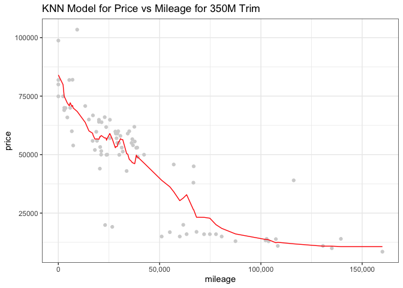

# Exercise 2

## KNN Practice

First we split the data based on whether the car has a trim level of 350
or 65 AMG. In the plot below we compare price vs mileage for each trim.
<!-- -->

First split the data into training and test sets for both trim data

Then Plot RMSE vs K graphs to find the K which gives the minimum RMSE
for both
    models

<!-- -->

    The KNN model with the minimum RMSE is fitted with K = 17 for a trim level of 350.

<!-- -->

    The KNN model with the minimum RMSE is fitted with K = 22 for a trim level of 65 AMG.

Lastly, plot both models over the test data.
<!-- --><!-- -->
Q2 advice: combine values from land model and house improvement
