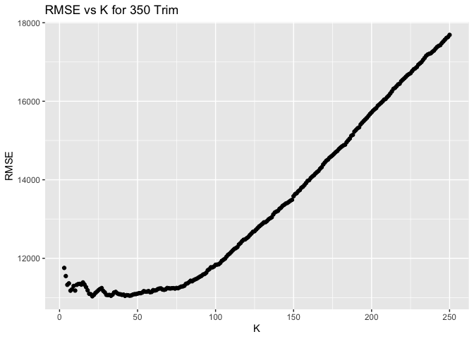
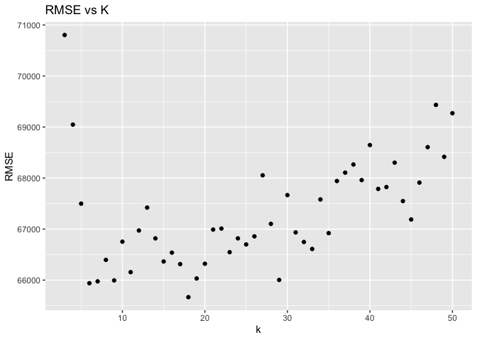

# Exercise 2

## KNN Practice

**Goal:** Build two KNN models for 350 and 65 AMG trim Mercedes to
predict car price given a car’s mileage.

-----

First we split the data based on whether the car has a trim level of 350
or 65 AMG. In the plot below we compare price vs mileage for each trim.

<!-- -->

As we can see from the above scatterplot, there is a group of 65 AMG
cars with 0 mileage which have a significantly higher price than the 350
trim cars. This will affect how the two models are built later.

Next we need to split the data into training and test tests and use the
training sets to fit two KNN models. This leads to the question of how
to pick the model parameters K for each model. One way to do this is to
pick the K which gives the minimum root mean square error (rmse) using
the test sets. Below is a plot of RMSE vs K for each
    model:

<!-- -->

    The KNN model with the minimum RMSE is fitted with K = 37 for a trim level of 350.

<!-- -->

    The KNN model with the minimum RMSE is fitted with K = 14 for a trim level of 65 AMG.

Now that we have fitted each model with a K parameter which minimizes
RMSE, we can plot both models over its corresponding test data to
visualize how the predictions (in red) compared with the actual values
(grey
points).

<!-- --><!-- -->

The 65 AMG model is always fitted with a higher K value than the 350
trim model. At the beginning of the analysis, it was pointed out that
there is a group of outlier 65 AMG trim cars which have significantly
higher price and 0 mileage. If we chose a lower K value for the 65 AMG
trim model, our predictions would have higher variance because the model
would memorize the noise of the outliers. Since the 350 trim model has
less extreme outliers choosing a smaller K doesn’t lead to as much error
as choosing a small K would in the 65 AMG model. Therefore a larger K
minimizes RMSE for the 65 AMG model and the oppositie is true for the
350 trim model.

## Saratoga House Prices

**Goal: Build Linear and KNN models which predict Saratoga House
Prices**

-----

### Linear Model

The table below shows the rmse of the medium model vs my “hand built”
model:

| Medium\_Model | New\_Model |
| :-----------: | :--------: |
|   66933.51    |  65445.56  |

Compared to the medium model, the new model has a lower RMSE. The new
model uses the equation:

**Price = lotSize \* livingArea + age + bathrooms:bedrooms + roomSize +
waterfront + centralAir + newConstruction + landValue:lotSize +
livingArea:waterfront + rooms + fireplaces:lotSize,
data=saratoga\_train**

To improve on the medium model I removed the variables: pct\_college,
heating, and fuel. I added the variables waterfront and newConstruction.
NewConstruction was a big driver of price because home buyers value new
properties more than one that has already been lived in. Homes being at
a waterfront location was also big driver of price due to it being one
of the most valued locations to have a house. In addition, I added a new
variable called roomSize which was calculated by dividing the size of
the house by the number of rooms. I also added multiple interactions
which were strong drivers of price. For example, I added an interaction
between bathrooms and bedrooms, because bathrooms connected to bedrooms
is important to house
buyers.

### KNN Model

``` r
data = SaratogaHouses %>% select(price,lotSize, livingArea, age, bathrooms, bedrooms, roomSize, rooms, waterfront, newConstruction, centralAir)

# change categorical vars to dummy vars
data$waterfront = ifelse(SaratogaHouses$waterfront == "Yes",1,0)
data$newConstruction = ifelse(SaratogaHouses$newConstruction == "Yes",1,0)
data$centralAir = ifelse(SaratogaHouses$centralAir == "Yes",1,0)

x = data %>% select(-price)
y = data %>% select(price)
 
# Averages RMSE over 100 train/test splits for each k
rmse_vals = foreach(K=3:50, .combine='c') %dopar% {
  rmse_val = do (100) *{
    train_cases = sample.int(n, n_train, replace=FALSE)
    test_cases = setdiff(1:n, train_cases)
    x_train = x[train_cases,]
    x_test = x[-train_cases,]
    y_train = y[train_cases,]
    y_test = y[-train_cases,]
    
    scale_factors = apply(x_train, 2, sd)
    x_train_sc = scale(x_train, scale=scale_factors)
    x_test_sc = scale(x_test, scale=scale_factors)
    knnModel = knn.reg(train=x_train_sc, test=x_test_sc, y = y_train, k=K)
    rmse(y_test, knnModel$pred)
  }
  mean(rmse_val$result)
}

rmse_grid = data.frame(k=3:50, RMSE= rmse_vals)
k = subset(rmse_grid, RMSE == min(rmse_vals))[1,1]
ggplot(rmse_grid) +
  geom_point(aes(k,RMSE)) +
  ggtitle("RMSE vs K")
```

<!-- -->

``` r
cat("The KNN model is fitted with K =",k, "has an average RMSE of", min(rmse_vals))
```

    ## The KNN model is fitted with K = 22 has an average RMSE of 65113.89
