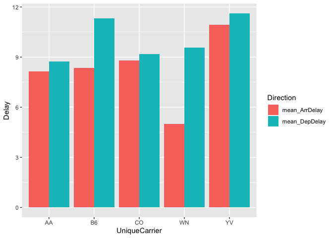

Exercise 1
==========

``` r
library(readr)
```

    ## Warning: package 'readr' was built under R version 3.4.4

``` r
library(tidyverse)
```

    ## ── Attaching packages ─────────────────────────────────────── tidyverse 1.3.0 ──

    ## ✓ ggplot2 3.2.1     ✓ dplyr   0.8.4
    ## ✓ tibble  2.1.3     ✓ stringr 1.4.0
    ## ✓ tidyr   1.0.2     ✓ forcats 0.4.0
    ## ✓ purrr   0.3.3

    ## Warning: package 'stringr' was built under R version 3.4.4

    ## Warning: package 'forcats' was built under R version 3.4.4

    ## ── Conflicts ────────────────────────────────────────── tidyverse_conflicts() ──
    ## x dplyr::filter() masks stats::filter()
    ## x dplyr::lag()    masks stats::lag()

``` r
library(mosaic)
```

    ## Warning: package 'mosaic' was built under R version 3.4.4

    ## Loading required package: lattice

    ## Warning: package 'lattice' was built under R version 3.4.4

    ## Loading required package: ggformula

    ## Loading required package: ggstance

    ## 
    ## Attaching package: 'ggstance'

    ## The following objects are masked from 'package:ggplot2':
    ## 
    ##     geom_errorbarh, GeomErrorbarh

    ## 
    ## New to ggformula?  Try the tutorials: 
    ##  learnr::run_tutorial("introduction", package = "ggformula")
    ##  learnr::run_tutorial("refining", package = "ggformula")

    ## Loading required package: mosaicData

    ## Warning: package 'mosaicData' was built under R version 3.4.4

    ## Loading required package: Matrix

    ## 
    ## Attaching package: 'Matrix'

    ## The following objects are masked from 'package:tidyr':
    ## 
    ##     expand, pack, unpack

    ## 
    ## The 'mosaic' package masks several functions from core packages in order to add 
    ## additional features.  The original behavior of these functions should not be affected by this.
    ## 
    ## Note: If you use the Matrix package, be sure to load it BEFORE loading mosaic.

    ## 
    ## Attaching package: 'mosaic'

    ## The following object is masked from 'package:Matrix':
    ## 
    ##     mean

    ## The following objects are masked from 'package:dplyr':
    ## 
    ##     count, do, tally

    ## The following object is masked from 'package:purrr':
    ## 
    ##     cross

    ## The following object is masked from 'package:ggplot2':
    ## 
    ##     stat

    ## The following objects are masked from 'package:stats':
    ## 
    ##     binom.test, cor, cor.test, cov, fivenum, IQR, median, prop.test,
    ##     quantile, sd, t.test, var

    ## The following objects are masked from 'package:base':
    ## 
    ##     max, mean, min, prod, range, sample, sum

``` r
urlfile = "https://raw.githubusercontent.com/jgscott/SDS323/master/data/ABIA.csv"
mydata <- read_csv(url(urlfile))
```

    ## Parsed with column specification:
    ## cols(
    ##   .default = col_double(),
    ##   UniqueCarrier = col_character(),
    ##   TailNum = col_character(),
    ##   Origin = col_character(),
    ##   Dest = col_character(),
    ##   CancellationCode = col_character()
    ## )

    ## See spec(...) for full column specifications.

``` r
grouped_Data <- mydata %>% group_by(UniqueCarrier) %>% summarise(mean_DepDelay=mean(DepDelay,na.rm=TRUE),mean_ArrDelay=mean(ArrDelay,na.rm=TRUE), count=n())
grouped_Data <- grouped_Data %>% arrange(desc(count))
grouped_Data <- grouped_Data %>% slice(1:5)
grouped_Data <- grouped_Data %>% gather("Direction","Delay",-count,-UniqueCarrier)
ggplot(grouped_Data,aes(x=UniqueCarrier,y=Delay,fill=Direction)) +
  geom_col(position = "dodge")
```


